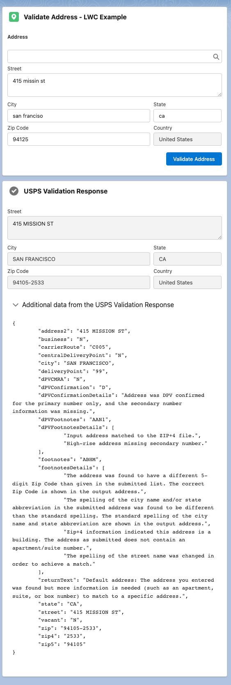

# Salesforce Apex SDK for the USPS Address API

This project aims to be a comprehensive Salesforce Apex SDK for the [USPS Address API](https://www.usps.com/business/web-tools-apis/address-information-api.htm).



## Getting Started

To work on this project in a scratch org:

1. Register for a [USPS Web Tools API Portal Account](https://www.usps.com/business/web-tools-apis/welcome.htm)
2. [Set up CumulusCI](https://cumulusci.readthedocs.io/en/latest/tutorial.html)
3. Run `cci flow run dev_org --org dev` to deploy this project.

### USPS Address API Username

After you register for a USPS Web Tools API Portal Account, you will be emailed a `USPS Username`. Create a new USPS Address API Setting Custom Metadata record using that username:
| Field | Value |
|-------|-------|
| Label | `USPS Username` |
| USPS Address API Setting Name | `USPS_Username` |
| Value | `Your Username` |


## Usage in Apex

There are three different USPS Address APIs that are exposed in this SDK:
1. Address Validation
2. ZIP Code Lookup
3. City State Lookup

### [Address Validation](https://www.usps.com/business/web-tools-apis/address-information-api.htm#_Toc110511810)

> Corrects errors in street addresses, including abbreviations and missing information, and supplies ZIP Codes and ZIP Codes + 4.

You will probably use this API the most. In fact, this is the API exposed in the Invocable Method that ships with this SDK.

You can validate a single address by building a `USPSAddressValidateRequest` object.
```
USPSRequest address = new USPSAddressValidateRequest()
.setAddress2('415 Mission Street')
.setCity('San Francisco')
.setZip5('94105');

USPSResponse response = new USPSAddressAPIService().send(address);

Assert.areEqual('415 MISSION ST', response.street, 'C! A! P! S! CAPS CAPS CAPS!');
```

You can validate multiple addresses by building `List<USPSAddressValidateRequest>` objects. Be aware that the USPS Address API can only validate 5 addresses at a time, so the callouts are batched accordingly. If you build 10 request objects, you will consume 2 callouts. If you build 501 request objects, [your transaction will fail](https://developer.salesforce.com/docs/atlas.en-us.apexcode.meta/apexcode/apex_callouts_timeouts.htm).
```
USPSRequest address1 = new USPSAddressValidateRequest()
.setAddress2('415 Mission Street')
.setCity('San Francisco')
.setZip5('94105');

USPSRequest address2 = new USPSAddressValidateRequest()
.setAddress2('1 Apple Park Way')
.setCity('Cupertino')
.setZip5('95014');

List<USPSRequest> addresses = new List<USPSRequest>{address1,address2};

List<USPSResponse> responses = new USPSAddressAPIService().send(addresses);

Assert.areEqual('SAN FRANCISCO', responses[0].city, '🌉');
Assert.areEqual('CUPERTINO', responses[1].city, '');
```

By default the Address Validation API returns a subset of fields in it's response. If you'd like for the API to return all of the fields, call the `setReturnAllData()` method.
```
USPSRequest address = new USPSAddressValidateRequest()
.setAddress2('415 Mission St')
.setCity('San Francisco')
.setZip5('94105');

USPSResponse response = new USPSAddressAPIService().setReturnAllData().send(address);

Assert.areEqual('Zip+4 information indicated this address is a building. The address as submitted does not contain an apartment/suite number.', response.footnotesDetails[0], 'Be sure to check out the demo app for a glimpse at all of the returns.');
```

### [ZIP Code Lookup](https://www.usps.com/business/web-tools-apis/address-information-api.htm#_Toc110511817)

> Returns the ZIP Code and ZIP Code + 4 corresponding to the given address, city, and state.

You can validate a single address by building a `USPSZipCodeLookupRequest` object. You can also validate multiple addresses by building a request list.
```
USPSRequest address = new USPSZipCodeLookupRequest()
.setAddress2('415 Mission St')
.setCity('San Francisco')
.setZip5('94105');

USPSResponse response = new USPSAddressAPIService().send(address);

Assert.areEqual('2533', response.zip4, 'Well, hello Zip+4.');
```

### [City State Lookup](https://www.usps.com/business/web-tools-apis/address-information-api.htm#_Toc110511824)

> Returns the city and state corresponding to the given ZIP Code.

You get the picture: use `USPSCityStateLookupRequest`.